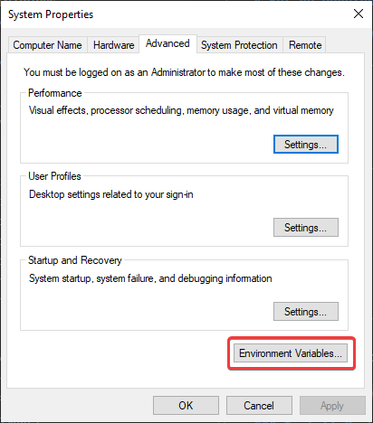
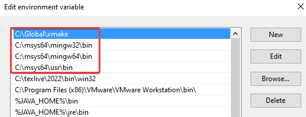

# Development Environment Configuration Guide

## Install toolchains

### On Windows

#### MSYS2 Installation

MSYS2 provides a seamless development environment for Windows. Follow the installation steps outlined on [MSYS2's official website](https://www.msys2.org/). It's recommended to retain the default installation directory (`C:/msys64`).

#### LLVM/Clang Toolchain and Essential Tools Installation on MSYS2

After installing MSYS2, launch `mingw32.exe` within the MSYS2 installation directory and execute the following commands to install LLVM/Clang toolchain, MinGW GCC toolchain, Boost library, SWIG, and git.

```sh
# Perform a full system upgrade first:
pacman -Syu
# Install LLVM/clang toolchain:
pacman -S mingw-w64-clang-i686-toolchain
# Install MinGW GCC toolchain:
pacman -S mingw-w64-i686-toolchain
# Install Boost library:
pacman -S mingw-w64-i686-boost
# Install SWIG:
pacman -S mingw-w64-i686-swig
# Install git:
pacman -S git
```

**Note:** If the download process seems sluggish, consider modifying the mirror lists under `/etc/pacman.d/` to prioritize faster mirrors.

#### Xmake Installation

Download `xmake-master.win64.zip` from [xmake's GitHub releases page](https://github.com/xmake-io/xmake/releases) and unpack it in a directory of your choice, such as `C:/Global`.

**Note:** Alternatively, you can install xmake via `winget` which automatically configures the `PATH` variable. Use `winget install --id=Xmake-io.Xmake -e` for installation.

#### Configure `Path` System Variable

To configure the `Path` system variable:

1. Press Win+R to open the Run dialog.
2. Enter `control sysdm.cpl,,3` and click OK.

   

3. Click on `Environment variables...`.

   

4. Under system variables, edit the `Path` variable and add the following paths to the list.

   

   - `C:/Global/xmake`
   - `C:/msys64/mingw32/bin`
   - `C:/msys64/mingw64/bin`
   - `C:/msys64/usr/bin`

   

   **Note:** Replace `C:/Global/xmake` with your xmake installation folder and `C:/msys64` with your MSYS2 installation folder.

   **Note:** Ensure the order of MSYS2 bin directories is as follows: `mingw32/bin`, `mingw64/bin`, `usr/bin`.

### On macOS

#### Homebrew Installation

Refer to [Homebrew's official website](https://brew.sh/) for installation instructions.

#### LLVM Toolchain and Essential Tools Installation with Homebrew

Execute the following commands to install LLVM/Clang toolchain, SWIG, and git via Homebrew:

```sh
# Install LLVM/clang toolchain:
brew install llvm
# Install SWIG:
brew install swig
# Install git:
brew install git
```

**Note:** Ensure that the system utilizes Homebrew's clang instead of Apple's clang. Search for "macOS switch Homebrew clang" for solutions.

### On Linux

Install the LLVM/Clang toolchain, SWIG, Git, and xmake using the package manager specific to your Linux distribution.

### Download MinGW Sysroot

*You can skip this part if you are on Windows.*

MinGW toolchain installation on macOS or Linux may not be compatible with our project. However, a compatible sysroot is essential. Download it from [here](https://github.com/kokoro11/FTL-Hyperspace/releases/tag/gcc). Unpack it in a suitable directory, e.g., `/opt/`.

## Test Xmake

Clone this project:

```sh
git clone https://github.com/kokoro11/FTL-Hyperspace
cd FTL-Hyperspace
```

Import xmake configurations and configure the project via GUI:

- On Windows, replace `<configs.txt>` with `xmake/windows-config-mingw.txt`.
- On macOS, replace `<configs.txt>` with `xmake/macos-config-mingw.txt`.
- On Linux, replace `<configs.txt>` with `xmake/linux-config-mingw.txt`.

```sh
xmake config -v --import=<configs.txt> --menu
```

On macOS or Linux, set the sysroot to the downloaded one. Navigate to `Project Configuration` -> `Toolchain Configs` -> `clang-mingw-32`. Select `Set clang sysroot path` and provide the sysroot path, e.g., `/opt/sysroot-i686-w64-mingw32`.

**Note:** Do not append a trailing slash to the sysroot path, e.g., `/opt/sysroot-i686-w64-mingw32` is correct, but `/opt/sysroot-i686-w64-mingw32/` is incorrect.

**Note:** If using the downloaded sysroot, enable the `Use system boost library` option under `Project Configuration` since boost library headers are included in the sysroot.

Generate compile commands (optional):

```sh
xmake project -k compile_commands
```

Build the project:

```sh
xmake build -v
```

### Xmake cheatsheet

```sh
# Show verbose info:
xmake <command> -v
# Show help info:
xmake <command> --help
# Config the project via GUI:
xmake config --menu
# Import project configs:
xmake config --import=<input file>
# Export project configs:
xmake config --export=<output file>
# Build the default target:
xmake build
# Generate compile_commands.json:
xmake project -k compile_commands
# Clean up build cache:
xmake clean
# Clean up all xmake cache including project configs and build cache:
xmake clean -a
# Remove all installed xmake packages:
xrepo remove --all
# Config only a single option (requires the plugin below):
xmake cu --<name>=<value>
```

**Note:** `xmake config` initiates a clean config from default configs. For incremental configs, install the plugin using `xmake plugin --install https://github.com/SirLynix/xmake-plugins`.

## Set Up VS Code

Install Visual Studio Code, then disable the default "C/C++" extension and install the "clangd" extension for improved C++ language support.

With these steps completed, you should now benefit from language intellisense while editing source files, along with enhanced build speed for the project.
